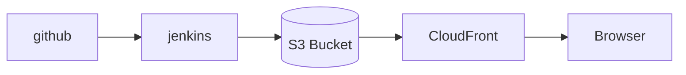

# CSR

Publishing

 
 

 
 

<!-- CSR 프로젝트의 배포는 비교적 간단하게 이루어 질 수 있습니다. 
컴퓨팅 리소스를 오로지 브라우저에서만 담당하기 때문에 serverless로도 충분히 프로젝트를 생성하고,
배포할 수 있습니다. 

또한 정적자산들이 CDN을 이용하기 때문에 global한 서비스에서도 장점을 발휘합니다.
 -->

