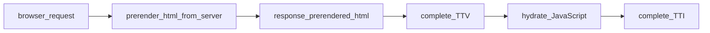
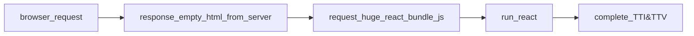

# SSR

Hydrate

 
 

NextJS

CRA

 
 

<!-- SSR의 개념에 대해 이해하려면 Hydrate의 개념을 먼저 이해햐아 합니다. 
Next.js에서 Hydration은 클라이언트 측에서 서버 측 렌더링된 HTML과 함께 전송된 JavaScript 코드를 실행하여 페이지의 인터랙티브한 부분을 초기화하는 과정을 의미합니다.

지금부터 위의 과정이 어떻게 일어나는지 간략하게 설명하겠습니다. 

1. browser의 request를 받으면 Next Server는 빠르게 html을 사전 랜더링하거나, 이미 생성한 html 파일을 브라우저에 제공합니다. 

2. 이 때 유저는 화면을 볼 수 있지만, 동작(interaction)은 할 수 없는데요.
아직 하이드레이션이 이루어지지 않았기 때문입니다.

3. 하이드레이션은 렌더링된 HTML에 이벤트 리스너, 리액트 상태 핸들링 등 자바스크립트 코드를 연결해주어 사이트의 인터렉션을 주입하는 개념으로 이해하시면 되는데요. 

4. Hydration은 두 가지 주요 단계로 이루어집니다. 첫 번째 단계는 초기 페이지 로딩 시 클라이언트에서 JavaScript 번들 파일을 다운로드하는 것입니다. 이 JavaScript 번들 파일에는 Next.js 클라이언트 측 라우팅과 상태 관리를 위한 코드가 포함될 수 있습니다. 이 파일은 서버로부터 전송된 HTML과 함께 전달됩니다.

5. 두 번째 단계는 JavaScript 코드가 실행되면서 해당 페이지의 컴포넌트를 초기화하는 것입니다. 이 과정에서 클라이언트에서 페이지의 상태를 복원하고, 이벤트 리스너를 등록하고, 필요한 데이터를 로드하는 등의 작업이 수행됩니다. 이 단계에서 컴포넌트의 상태와 DOM 요소들이 서버에서 렌더링된 초기 상태와 일치하도록 업데이트됩니다.

매말랐던 스펀지에 물이 빠르게 흡수되듯이, 우리의 웹 페이지는 hydration과정을 통해 빠르게 인터렉티브해집니다.

5. 그러면 왜 이러한 과정이 필요한 것일까요? 

6. 이는 Next.js가 이미 서버에서 보여줄 HTML 컨텐츠를 프리랜더해서 가져오기 때문에, JavaScript가 실행되며 재차 DOM을 그리는 일은 비효율적이기 때문입니다. (참고로 Dom 요소를 새롭게 업데이트 하는 작업은 코스트가 큰 작업입니다. 우리가 리액트를 사용하는 이유중 하나이기도 하죠) 따라서 render()메소드가 아닌 hydrate() 메소드로 서버에서 받아온 HTML을 클라이언트에서 다시 재구성 하는 행위를 최소한으로 하고, 이미 구성된 DOM 요소에 유저가 상호작용할 수 있는 이벤트 리스너만 연결하는 것입니다. 
 -->