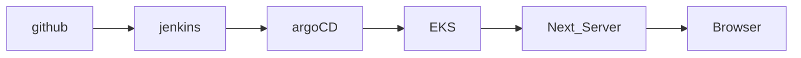

# SSR

Publishing

 
 

```mermaid
flowchart LR
  github --> jenkins --> argoCD --> EKS --> Next_Server --> Browser
```

 
 

<!-- SSR의 배포 프로세스는 아래와 같습니다. 
서버가 존재하기 때문에 EKS를 활용하고 있으며 CSR보다는 보다 복잡한 프로세스를 가지고 있습니다.
 -->

